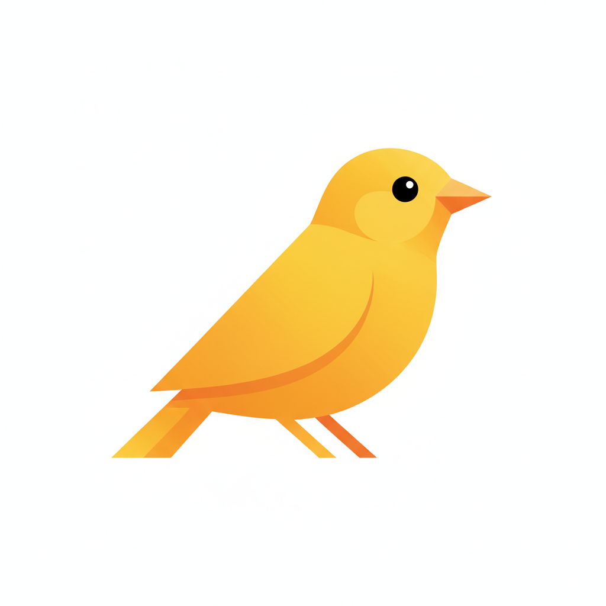

<p align="center">
  
</p>

# Kanario

Blog thumbnail generator. Reads a WordPress draft, generates image prompts via an LLM (Gemini or Claude), then produces cover images via an image backend (Qwen Image Edit on RunPod or Nano Banana on Vertex AI).

Works as a **CLI** (`./kanario`) or a **Discord bot** (`/generate`, `/improve`, `/pick`). Both interfaces use the same underlying workflows.

Given a post ID (or URL), the CLI:

1. Fetches the draft from WordPress REST API
2. Summarizes the full post content via a fast LLM (Gemini Flash or Claude Haiku) to extract key points
3. Sends the summary to an LLM (Gemini by default, or Claude), which generates scene descriptions — the LLM decides per scene whether a mascot character fits or if a scene-only diorama works better
4. Submits image jobs (1 per prompt) to the chosen image backend (Qwen on RunPod or Nano Banana on Vertex AI)
5. Saves everything to `output/<post-id>/`

Once you've picked a favorite, the `pick` subcommand uploads it to WordPress and sets it as the post's featured image.

## Setup

```bash
npm install
cp .env.example .env  # fill in credentials
```

### Environment variables

| Variable | Description |
|---|---|
| `WP_URL` | WordPress site URL (default: `https://blog.codeminer42.com`) — CLI only |
| `WP_USERNAME` | WordPress username — CLI only |
| `WP_APP_PASSWORD` | WordPress application password ([how to get one](#wordpress-application-password)) — CLI only |
| `GEMINI_API_KEY` | Google Vertex AI API key (default model + Nano Banana image backend — [get one from Vertex AI Studio](https://console.cloud.google.com/vertex-ai)) |
| `ANTHROPIC_API_KEY` | Anthropic API key (only needed with `--model claude`) |
| `RUNPOD_API_KEY` | RunPod API key (only needed with `--image-model qwen`, the default — from [runpod.io](https://www.runpod.io/) account settings) |
| `DISCORD_TOKEN` | Discord bot token (only needed for Discord bot) |
| `DISCORD_PUBLIC_KEY` | Discord application public key (only needed for Discord bot) |
| `DISCORD_APPLICATION_ID` | Discord application ID (only needed for Discord bot) |
| `CREDENTIAL_ENCRYPTION_KEY` | 32-byte hex key for AES-256-GCM encryption of stored WP passwords (Discord bot only, optional for local dev) |

### WordPress Application Password

The CLI authenticates with the WordPress REST API using [Application Passwords](https://make.wordpress.org/core/2020/11/05/application-passwords-integration-guide/) (built into WordPress, no plugins needed).

To create one:

1. Log into WordPress admin (`/wp-admin/`)
2. Go to **Users → Profile**
3. Scroll to the **Application Passwords** section
4. Enter a name (e.g. "Kanario") and click **Add New Application Password**
5. Copy the generated password — it's only shown once

Your user must have **Editor** or **Administrator** role to access draft posts via the REST API.

## Usage

### Generate thumbnails

```bash
./kanario <post-id-or-url> [--model gemini|claude] [--image-model qwen|nano-banana] [--no-wide] [--hint <text>]
```

Options:

| Flag | Description |
|---|---|
| `--model` | LLM for prompt generation: `gemini` (default) or `claude` |
| `--image-model` | Image generation backend: `qwen` (default, RunPod) or `nano-banana` (Vertex AI) |
| `-o, --output` | Custom output directory (default: `output/<post-id>`) |
| `--no-wide` | Disable 16:9 padding, output matches mascot aspect ratio (square) |
| `--hint` | Guide the visual metaphor (e.g. `"two models competing side by side"`) — also useful to force a mascot when the LLM omits one |
| `-h, --help` | Show help |

Examples:

```bash
./kanario 12487
./kanario 12487 --no-wide
./kanario 12487 --model claude
./kanario 12487 --image-model nano-banana
./kanario "https://blog.codeminer42.com/wp-admin/post.php?post=12487&action=edit"
./kanario "https://blog.codeminer42.com/some-post-slug/"
```

### Improve an existing image

```bash
./kanario improve <post-id> <image> --prompt "your instructions"
```

Iterates on an existing generated image. The source image is sent as-is to the image backend with your prompt (no style template wrapping). Generates 2 new variants with the next available numbers (e.g. `prompt-6.png`, `prompt-7.png`).

`<image>` accepts a shorthand like `2` (resolves to `output/<post-id>/prompt-2.png`) or a full file path.

Examples:

```bash
./kanario improve 12487 2 --prompt "make the background darker"
./kanario improve 12487 3 --prompt "remove the robot and add more plants"
./kanario improve 12487 /path/to/image.png --prompt "make it more vibrant"
```

### Pick & upload featured image

```bash
./kanario pick <post-id-or-url> <image>
```

`<image>` accepts a shorthand like `2` (resolves to `output/<post-id>/prompt-2.png`) or a full file path.

Shows the post title and image path, then asks for confirmation before uploading.

Examples:

```bash
./kanario pick 12487 2
./kanario pick 12487 /path/to/custom.png
```

Output goes to `output/<post-id>/`:

```
output/12345/
├── prompt-1.png
├── prompt-2.png
├── prompt-3.png
├── prompt-4.png
└── prompts.json
```

## Discord Bot

The same generate and pick workflows are available as Discord slash commands, so the team can trigger thumbnail generation and pick images directly from a channel.

### Setup

1. Create a Discord application at [discord.com/developers](https://discord.com/developers/applications)
2. Create a bot under the application and copy the **Bot Token** → `DISCORD_TOKEN`
3. Copy the **Application ID** → `DISCORD_APPLICATION_ID`
4. Copy the **Public Key** → `DISCORD_PUBLIC_KEY`
5. Add the bot to your server with the `applications.commands` scope
6. Register slash commands:

```bash
npm run discord:register
```

7. Start the server locally (for development) or deploy to Cloud Run (for production):

```bash
npm run server                                    # local
GCP_PROJECT_ID=your-project ./deploy/deploy.sh    # Cloud Run
```

8. Set the **Interactions Endpoint URL** in the Discord developer portal to the Cloud Run service URL + `/interactions` (see [Deployment](#deployment-cloud-run))

### Per-user WordPress credentials

The Discord bot uses **per-user WordPress credentials** — each team member registers their own WP credentials so actions are attributed correctly. The CLI continues using environment variables as before.

**Registration flow:**

1. DM the bot: `/register wp_url:https://blog.codeminer42.com username:your-wp-user app_password:xxxx xxxx xxxx`
2. The bot validates the credentials against the WordPress API
3. On success, credentials are stored (encrypted with AES-256-GCM if `CREDENTIAL_ENCRYPTION_KEY` is set)
4. Now `/generate` and `/pick` use your credentials

For security, `/register` must be used in a **DM with the bot** — it will reject the command if used in a channel (where the password would be visible to others).

To generate an encryption key:

```bash
node -e "console.log(require('crypto').randomBytes(32).toString('hex'))"
```

### Commands

| Command | Description |
|---|---|
| `/help` | Learn how Kanario works |
| `/register wp_url username app_password` | Register your WordPress credentials (DMs only) |
| `/unregister` | Remove your stored WordPress credentials |
| `/whoami` | Show your registered URL and username (no password) |
| `/generate post_id [model] [image_model] [hint]` | Generate 5 thumbnail images for a WordPress post (requires registration) |
| `/improve post_id image_url prompt [image_model]` | Iterate on a generated image with a new prompt |
| `/pick post_id image` | Upload an image and set it as the post's featured image (requires registration) |

All commands use deferred responses (Discord's 3s deadline). `/help`, `/register`, `/unregister`, and `/whoami` are ephemeral (only visible to you). `/generate`, `/improve`, and `/pick` results are visible to the channel.

`/generate` and `/improve` show live progress updates in the deferred message while images are being generated. Each workflow step replaces the message content with an accumulated log inside a code block. The final message with attached images replaces the progress log.

### Health check

```
GET /health → { "status": "ok" }
```

## Deployment (Cloud Run)

The Discord bot runs on Google Cloud Run so it's always available at a public HTTPS URL for Discord interaction webhooks.

### Prerequisites

- [Google Cloud CLI](https://cloud.google.com/sdk/docs/install) (`gcloud`) installed and authenticated
- A GCP project with Cloud Run and Artifact Registry APIs enabled
- An Artifact Registry Docker repository named `kanario` in your region:

```bash
gcloud artifacts repositories create kanario \
  --repository-format=docker \
  --location=southamerica-east1 \
  --project=edy-ai-playground
```

### Build and deploy

```bash
GCP_PROJECT_ID=edy-ai-playground ./deploy/deploy.sh
```

The script builds the Docker image via Cloud Build, pushes it to Artifact Registry, and deploys to Cloud Run. It prints the service URL when done.

Optional env vars:
- `GCP_REGION` — Cloud Run region (default: `southamerica-east1`)

### Credential storage (GCS FUSE)

Per-user WordPress credentials are stored in a SQLite database. On Cloud Run, the DB file lives on a GCS bucket mounted via Cloud Storage FUSE.

One-time setup:

```bash
# Create the bucket
gcloud storage buckets create gs://kanario-credentials --location=southamerica-east1
```

The `deploy.sh` script automatically mounts the bucket at `/app/data/` using `--add-volume` and `--add-volume-mount` flags.

### Set secrets

After the first deploy, set the required environment variables on the Cloud Run service:

```bash
gcloud run services update kanario-discord \
  --region southamerica-east1 \
  --set-env-vars "GEMINI_API_KEY=...,RUNPOD_API_KEY=...,DISCORD_TOKEN=...,DISCORD_PUBLIC_KEY=...,DISCORD_APPLICATION_ID=...,CREDENTIAL_ENCRYPTION_KEY=..."
```

Note: `WP_USERNAME` and `WP_APP_PASSWORD` are no longer needed on the Discord bot — each user registers their own credentials via `/register`.

For production, consider using [GCP Secret Manager](https://cloud.google.com/run/docs/configuring/secrets) with the `--set-secrets` flag instead.

### Configure Discord

Set the **Interactions Endpoint URL** in the [Discord developer portal](https://discord.com/developers/applications) to:

```
https://kanario-discord-740315580644.southamerica-east1.run.app/interactions
```

Discord will send a PING to verify the endpoint responds with PONG before saving.

> **Current service URL:** `https://kanario-discord-740315580644.southamerica-east1.run.app`

### Service settings

| Setting | Value |
|---|---|
| Memory | 512 Mi |
| CPU | 1 |
| CPU throttling | Off (background work runs after the deferred response) |
| Timeout | 300s |
| Min instances | 0 (scales to zero) |
| Max instances | 3 |
| Port | 8080 |

## RunPod Hub API (qwen-image-edit)

Image generation uses RunPod Hub's **public serverless endpoint** — no custom deployment needed. ~$0.02/request.

### How it works

There are two modes:

- **Async** (`/run`) — submit a job, poll `/status/{id}`, download result. This is what we use.
- **Sync** (`/runsync`) — blocks until the job completes and returns the result in the response. Simpler but has a 90-second timeout, so it can fail on cold starts or slow generations.

Our workflow (async):

1. **Submit a job** — `POST /run` returns a job ID
2. **Poll for status** — `GET /status/{id}` until `COMPLETED`
3. **Download the image** — result is a CloudFront URL in `output.result`

### API reference

Base URL: `https://api.runpod.ai/v2/qwen-image-edit`

All requests require: `Authorization: Bearer {RUNPOD_API_KEY}`

#### Submit job

```
POST /run
Content-Type: application/json

{
  "input": {
    "prompt": "description of the scene",
    "image": "data:image/png;base64,{base64data}",
    "seed": 12345,
    "output_format": "png"
  }
}
```

The `image` field accepts:
- A **public URL** (must be publicly accessible — private GitHub raw URLs won't work)
- **Inline base64** with data URI prefix: `data:image/png;base64,{base64data}`

We use base64 because the kanario repo is private and raw GitHub URLs return 404.

Response:
```json
{ "id": "job-id", "status": "IN_QUEUE" }
```

#### Poll status

```
GET /status/{job-id}
```

Status values: `IN_QUEUE` → `IN_PROGRESS` → `COMPLETED` or `FAILED`.

Poll interval of 3 seconds works well. Jobs typically complete in 10-30 seconds.

#### Completed response

```json
{
  "id": "job-id",
  "status": "COMPLETED",
  "output": {
    "cost": 0.02,
    "result": "https://d2p7pge43lyniu.cloudfront.net/output/{uuid}.png"
  }
}
```

The result is a **CloudFront CDN URL** — fetch it to download the PNG.

#### Failed response

```json
{
  "id": "job-id",
  "status": "FAILED",
  "error": "Error during processing: ...",
  "output": { "status": "failed" }
}
```

#### Sync mode (not used)

`POST /runsync` takes the same request body as `/run` but blocks until the job finishes:

```json
{
  "id": "job-id",
  "status": "COMPLETED",
  "output": { "cost": 0.02, "result": "https://...cloudfront.net/output/{uuid}.png" }
}
```

Simpler (no polling loop), but has a **90-second timeout**. If the worker cold-starts or the generation is slow, the request will time out. We use `/run` + polling to avoid this.

### Gotchas

- **Output is a URL, not base64.** RunPod docs may suggest `output.output_image_base64`, but the actual response uses `output.result` containing a CloudFront URL.
- **Private repo URLs don't work.** RunPod's worker fetches the image server-side, so any URL must be publicly accessible. Use inline base64 for private assets.
- **Single image reference.** The `image` field takes one reference image, not multiple.
- **No width/height params.** Output dimensions match the input image. We pad the mascot onto a 1280×720 white canvas before sending so the output is widescreen.

## Legacy: Custom RunPod Server

The `server/` directory contains a FastAPI server that runs Qwen Image Edit on a custom GPU pod. This was replaced by the RunPod Hub public endpoint above, but the code is kept for reference.

### Deploy

Requires `RUNPOD_API_KEY` and `RUNPOD_DOCKER_IMAGE` env vars.

```bash
./server/deploy-runpod.sh push      # build + push Docker image
./server/deploy-runpod.sh deploy    # create A100 80GB pod
./server/deploy-runpod.sh status    # check pod status + server URL
./server/deploy-runpod.sh stop      # pause (no GPU charge, volume preserved)
./server/deploy-runpod.sh start     # resume
./server/deploy-runpod.sh destroy   # delete pod + volume
```

## Tests

```bash
npm test              # unit tests (no network, no .env)
./test/smoke.sh       # smoke test — generates real images for 3 posts, opens output
```

## Stack

- Node.js >= 22 (native fetch, `--experimental-strip-types`, `--experimental-sqlite`, `node:test`)
- Two LLM SDKs: `@google/genai` (Gemini via Vertex AI), `@anthropic-ai/sdk` (Claude)
- `sharp` for image processing (padding mascot to widescreen canvas)
- `fastify` for the Discord bot HTTP server (Ed25519 signature verification via Node built-in `crypto.subtle`)
- RunPod Hub serverless endpoint for Qwen Image Edit (default image backend)
- Nano Banana (Gemini 2.5 Flash Image) via Vertex AI Express API (alternative image backend, reuses `GEMINI_API_KEY`)
